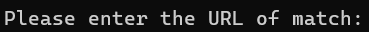

# Tenhou Paifu Logger

 

Logging tenhou paifu into excel or html file with some key information.

[Downloads](https://github.com/Jim137/Tenhou-Paifu-Logger/releases/latest) | [中文說明](https://github.com/Jim137/Tenhou-Paifu-Logger/blob/master/READMEs/README_zh.md)

## Usage

1. Clone the repository or download the [latest release](https://github.com/Jim137/Tenhou-Paifu-Logger/releases/latest).
   
   `git clone https://github.com/Jim137/Tenhou-Paifu-Logger.git`
   
2. Copy the paifu URL from tenhou.net to clipboard.
3. Open `runlog-user.bat`.
4. Once  appears, paste the paifu URL and press Enter.
5. After  appears, the paifu is successfully logged.
6. When  appears again, you can paste the next the URL.

## Features
* [x] Log paifu into excel or html file with some key information.
* [x] Distinguish Sanma(3p) and Yonma(4p) and log into separate sheets.
* [x] Skip duplicated paifu
* [x] Remake the paifu with URL already logged (-r, --remake). It will be useful when we updated the logging information in future.

## Information logged

* Game time
* Placing
* URL (for future use)
* Rate before the game

## Future features

* [ ] Add match replay for every round in html file
* [ ] The change of Rate
* [ ] Agari analysis
* [ ] Support Majsoul paifu
* [ ] GUI

## License

[MIT](LICENSE)
