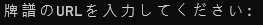

# Tenhou Paifu Logger

[](https://github.com/Jim137/Tenhou-Paifu-Logger/actions/workflows/publish-to-test-pypi.yml)
[](https://github.com/Jim137/Tenhou-Paifu-Logger/actions/workflows/test.yml)
[ ](https://pypi.org/project/PaifuLogger/)
[](https://pepy.tech/project/Paifulogger)
[](https://github.com/Jim137/Tenhou-Paifu-Logger/)
[](https://github.com/Jim137/Tenhou-Paifu-Logger/releases)


CSV、ExcelまたはHTMLファイルに天鳳の牌譜をいくつかの主要情報とともに記録します。


このプロジェクトが気に入った場合は、スターを付けていただけると大変励みになります。また、提案がある場合は、遠慮なく問題を作成してください。

[ダウンロード](https://github.com/Jim137/Tenhou-Paifu-Logger/releases/latest) | [English](https://github.com/Jim137/Tenhou-Paifu-Logger/blob/master/README.md) | [中文說明](https://github.com/Jim137/Tenhou-Paifu-Logger/blob/master/READMEs/README_zh.md)

## 使い方

1. プロジェクトをダウンロードします。

> a. GitHubからダウンロードします。
>
>> i. リポジトリをクローンするか、[最新リリース](https://github.com/Jim137/Tenhou-Paifu-Logger/releases/latest)をダウンロードします。
>>
>> ```
>> git clone https://github.com/Jim137/Tenhou-Paifu-Logger.git
>> ```
>>
>> ii. 天鳳.netから牌譜のURLをクリップボードにコピーします。
>>
>> iii. `runlog-user.bat`を開きます。
>
> b. PyPIからダウンロードします。
>
>> i. コマンドラインを開き、次のコマンドを入力します。
>>
>> ```
>> pip install PaifuLogger
>> ```
>>
>>ii. 天鳳.netから牌譜のURLをクリップボードにコピーします。次に、次のコマンドを入力します。
>>
>> ```
>> plog -l [言語] -o [出力ディレクトリ] [牌譜のURL]
>> ```

2. 一度  が表示されると、牌譜のURLを貼り付けてEnterキーを押します。\
注意: 最新バージョンでは、一度に複数のURLを任意の区切り文字で区切って入力できます。 pre> 怠け者の場合は、何も貼り付けないでください。
3.  が表示された後、牌譜は正常に記録されます。
4. 再び  が表示されると、次のURLを貼り付けることができます。

## 機能
* [x] 複数のURLを一度にサポートします。
* [x] いくつかの主要情報とともに牌譜をExcelまたはHTMLファイルに記録します。
* [x] 一度に複数のフォーマットをサポートします。 (例: -f csv -f html; -a, --all-formats)
* [x] 三麻(3p)と四麻(4p)を区別し、別々のシートに記録します。
* [x] 重複する牌譜をスキップします。
* [x] 既に記録されたURLで牌譜を再作成します (-r、--remake)。将来的に記録情報を更新した場合に便利です。
* [x] カスタマイズ可能な出力ディレクトリ (-o、--output)
* [x] mjai形式の牌譜出力サポート (--mjai)。*最初に `git pull --recurse-submodules` を実行する必要があります*。
* [x] ローカライズ対応 (-l、--language)
  * [x] 英語: en
  * [x] 繁体字中国語: zh_tw
  * [x] 簡体字中国語: zh
  * [x] 日本語 (ChatGPT): ja
* [x] configファイル設定のサポート。`config.json` を同じ環境に配置すると、ローカル設定が有効になります。グローバル設定を有効にするには、下記の場所に `config.json` を配置します。
  * Windows: `%localappdata%\Jim137\paifulogger\config.json`
  * macOS: `/Users/{UserName}/Library/Application Support/paifulogger/config.json`
  * Linux: `~/.local/share/paifulogger/config.json`

## 記録される情報

* ゲームの時間
* 順位
* URL (将来のために)
* ゲーム前のレート
* レート変化
* 和了数
* 放銃数

## 将来の機能

* [ ] 各ラウンドの試合リプレイをHTMLファイルに追加
* [ ] 和了解析
* [ ] Majsoul牌譜のサポート
* [ ] GUI

## 貢献
バグ報告、プルリクエスト、機能要求、ドキュメントの改善、ローカリゼーションなど、さまざまな貢献を歓迎します。

詳細については、[CONTRIBUTING.md](https://github.com/Jim137/Tenhou-Paifu-Logger/blob/master/CONTRIBUTING.md) をご覧ください。

## ライセンス

[MIT](LICENSE)

---

（この翻訳はChatGPTによって生成されました。）
